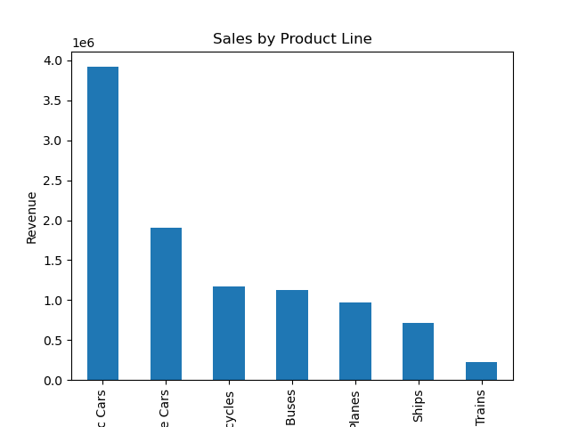
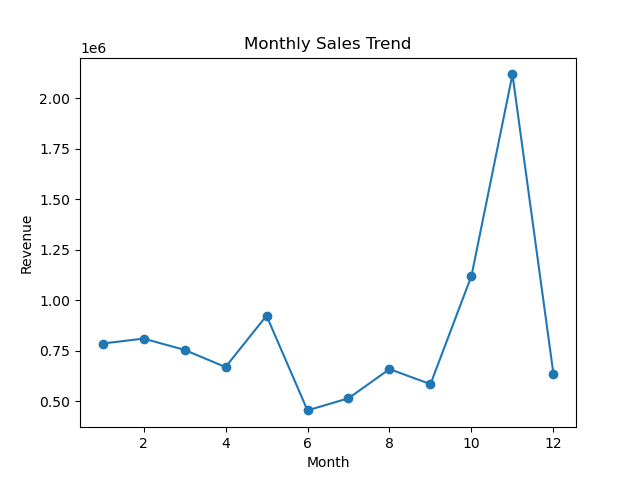
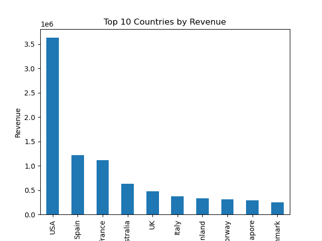
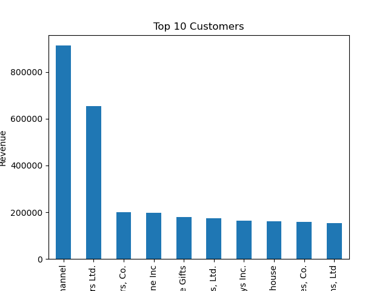

# Sales Data Analysis Dashboard

## Overview
This project analyzes sales data to find business insights such as total revenue, best-selling products, monthly sales trends, and top-performing regions.

## Tools Used
- Python
- Pandas
- Matplotlib
- SQL
- Jupyter Notebook
- GitHub

## Business Questions
1. What is the total revenue?
2. Which products sell the most?
3. Which region has the highest sales?
4. What are the monthly sales trends?
5. Which customers generate the most revenue?

## Project Files
- `sales_analysis.ipynb` - Python analysis notebook
- `sales_data.csv` - Dataset
- `sales_queries.sql` - SQL queries
- `images/` - Charts and dashboard screenshots

## Key Insights
- Identified highest revenue-generating product lines
- Analyzed monthly sales trends
- Found top-performing countries by revenue
- Identified highest-value customers
- Created business visualizations using Matplotlib

## Sample Visualizations

### Sales by Product Line


### Monthly Sales Trend


### Top Countries by Revenue


### Top Customers



## How to Run
1. Clone this repository
```bash
git clone https://github.com/pragyapaliwalsharma-hue/sales-data-analysis-dashboard.git

2. Open the project folder
3. Install required libraries
```bash
pip install pandas matplotlib

4. Open Jupyter Notebook
jupyter notebook

5. Open:
sales_analysis.ipynb

6. Run all notebook cells to reproduce the analysis and charts

Then:
1. Click **Commit changes**
2. Commit again

Now your README will look much more complete and professional.

